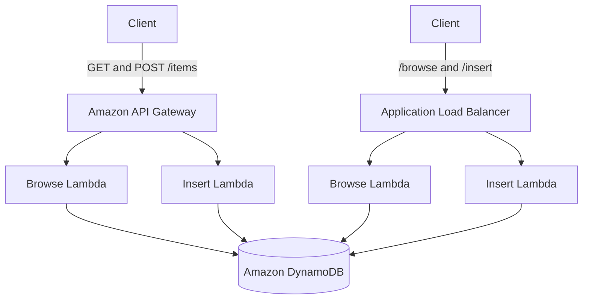

# ALB vs API Gateway on AWS


## Project Overview

This hands-on AWS project compares two methods of exposing serverless backend functions:

1. Amazon API Gateway integrated with AWS Lambda
2. Application Load Balancer integrated with AWS Lambda

Both architectures use Lambda functions to browse and insert items stored in a shared Amazon DynamoDB table.

The project demonstrates:

- HTTP method-based routing with API Gateway
- Path-based routing with an Application Load Balancer
- Lambda proxy integration
- ALB Lambda target groups
- API deployment stages
- Endpoint testing with AWS CloudShell and `curl`
- Architectural differences between API Gateway and ALB

## Architecture



## AWS Services Used

- Amazon API Gateway
- Application Load Balancer
- AWS Lambda
- Amazon DynamoDB
- Amazon VPC
- AWS CloudShell
- AWS Identity and Access Management

## Project Objectives

- [ ] Configure the missing API Gateway `POST /items` method
- [ ] Enable Lambda proxy integration
- [ ] Deploy the REST API to the `prod` stage
- [ ] Add an ALB listener rule for `/insert*`
- [ ] Route `/insert*` requests to the Insert Lambda target group
- [ ] Test the ALB browse endpoint
- [ ] Test the ALB insert endpoint
- [ ] Test the API Gateway GET endpoint
- [ ] Test the API Gateway POST endpoint
- [ ] Compare ALB and API Gateway behaviour
- [ ] Document troubleshooting and lessons learned

## Implementation

### Part 1 — API Gateway Configuration

Documentation will be added after completing the API Gateway configuration.

### Part 2 — Application Load Balancer Configuration

Documentation will be added after completing the ALB listener configuration.

### Part 3 — Endpoint Testing

### ALB Browse Endpoint

Command:

```bash
curl "http://<ALB-DNS>/browse"
```

Result:

- Request successfully routed through ALB
- Browse Lambda executed
- DynamoDB records returned
- 3 items retrieved


### ALB Insert Endpoint

Command:

```bash
curl -X POST "http://<ALB-DNS>/insert" \
-H "Content-Type: application/json" \
-d '{"name":"ALB Test Item","description":"Testing ALB insert"}'
```

Result:

- Request routed through ALB
- Insert Lambda executed successfully
- New DynamoDB item created


### API Gateway GET Endpoint

Command:

```bash
curl "https://<api-id>.execute-api.us-east-1.amazonaws.com/prod/items"
```

Result:

- API Gateway routed the request using the GET method
- Browse Lambda executed successfully
- DynamoDB items returned
- Previously inserted ALB records were visible


## Screenshots

Screenshots will be added throughout the implementation.

## ALB vs API Gateway Comparison
### VPC Requirement

One of the key differences discovered during this lab was networking.

**Application Load Balancer (ALB)** must be deployed into a customer VPC and attached to one or more subnets across Availability Zones.


Observed configuration:

- VPC attached
- Multiple Availability Zones
- Multiple subnets
- Internet-facing deployment

**API Gateway**, on the other hand, is a managed AWS service and does not require deployment into customer VPC subnets.

| Category | API Gateway | Application Load Balancer |
|---|---|---|
| Primary routing | HTTP methods and resources | Listener conditions such as paths and hosts |
| Networking | AWS-managed service; no customer VPC required for the API itself | Must be deployed in VPC subnets |
| Default endpoint encryption | HTTPS | HTTP unless an HTTPS listener and certificate are configured |
| Backend targets | Lambda and multiple AWS service integrations | Lambda, EC2, IP addresses and containers |
| API management | Throttling, authorization, stages and transformations | Requires additional services or backend logic |
| Cost model | Request-based | Hourly capacity and usage charges |
| Best suited for | Managed APIs and serverless microservices | Web applications and diverse backend targets |

## Key Learnings

To be completed after the workshop.

## Troubleshooting

To be completed during the workshop.

## Cleanup

Workshop resources should be removed or allowed to expire after testing to avoid unnecessary AWS charges.

## Author

**Nelvin Robinson**

AWS Solutions Architect learner and CloudWithRaj Cohort 8 participant.
