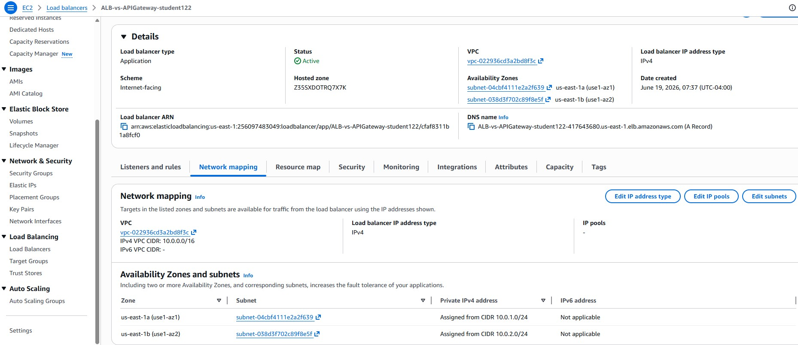
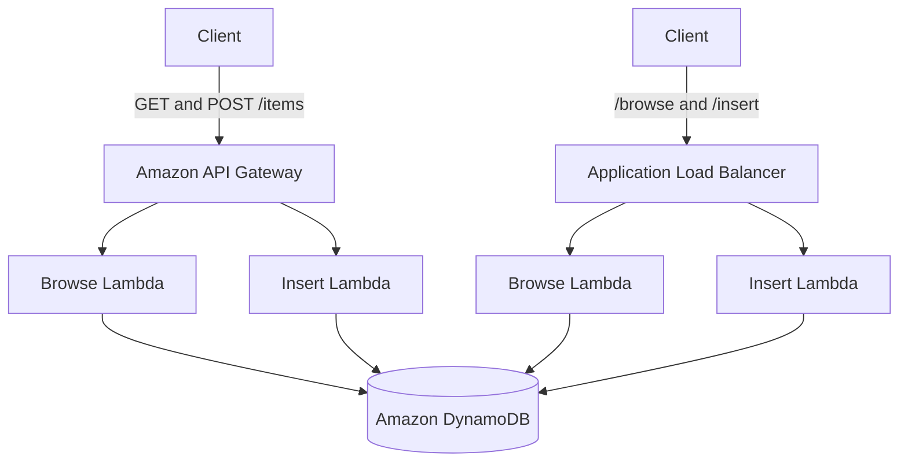
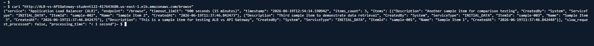
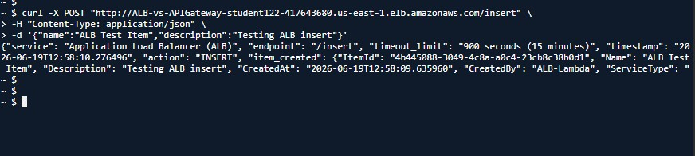
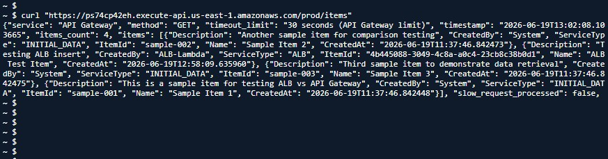
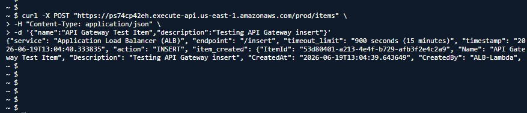
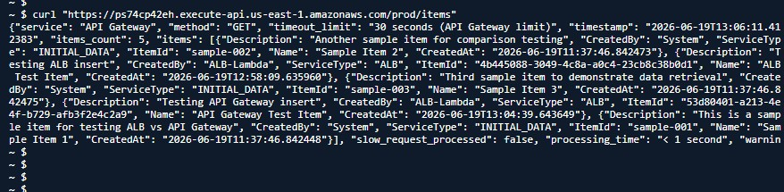

# ALB vs API Gateway on AWS


## Project Overview

This hands-on AWS project compares two methods of exposing serverless backend functions:

1. Amazon API Gateway integrated with AWS Lambda
2. Application Load Balancer integrated with AWS Lambda

Both architectures use Lambda functions to browse and insert items stored in a shared Amazon DynamoDB table.

## Project Outcome

Successfully configured and tested two different serverless request-routing architectures on AWS:

* Amazon API Gateway → AWS Lambda → DynamoDB
* Application Load Balancer → AWS Lambda → DynamoDB

Both architectures were able to:

* Retrieve records from DynamoDB
* Insert new records into DynamoDB
* Handle HTTP requests successfully
* Demonstrate different routing and networking models

The final validation confirmed that records created through both ALB and API Gateway were stored in and retrieved from the same DynamoDB table.

## Project Metrics

- Services Used: 7 AWS Services
- Lambda Functions: 4
- DynamoDB Tables: 1
- API Endpoints Tested: 4
- Routing Methods Compared: 2
- Validation Status: Successful
  
## Architecture

### Architecture Flow

Client requests are routed through either:

1. Amazon API Gateway using HTTP method-based routing.
2. Application Load Balancer using path-based routing.

Both services invoke AWS Lambda functions that interact with a shared Amazon DynamoDB table for data storage and retrieval.




## AWS Services Used

- Amazon API Gateway
- Application Load Balancer
- AWS Lambda
- Amazon DynamoDB
- Amazon VPC
- AWS CloudShell
- AWS Identity and Access Management

## Project Objectives

- [x] Configure the missing API Gateway `POST /items` method
- [x] Enable Lambda proxy integration
- [x] Deploy the REST API to the `prod` stage
- [x] Add an ALB listener rule for `/insert*`
- [x] Route `/insert*` requests to the Insert Lambda target group
- [x] Test the ALB browse endpoint
- [x] Test the ALB insert endpoint
- [x] Test the API Gateway GET endpoint
- [x] Test the API Gateway POST endpoint
- [x] Compare ALB and API Gateway behaviour
- [x] Document troubleshooting and lessons learned

## Implementation

### Part 1 — API Gateway Configuration

Tasks completed:

1. Opened the existing REST API.
2. Selected the `/items` resource.
3. Created a new `POST` method.
4. Enabled Lambda Proxy Integration.
5. Connected the method to the Insert Lambda function.
6. Deployed the API to the `prod` stage.

Result:

* GET requests returned DynamoDB records.
* POST requests successfully created new items.

### Part 2 — Application Load Balancer Configuration

Tasks completed:

1. Opened the HTTP:80 listener.
2. Reviewed the existing `/browse*` rule.
3. Added a new `/insert*` path rule.
4. Forwarded traffic to the Insert Lambda target group.
5. Assigned rule priority 2.

Result:

* `/browse` requests routed to Browse Lambda.
* `/insert` requests routed to Insert Lambda.

### Part 3 — Endpoint Testing

#### ALB Browse Endpoint

Command:

```bash
curl "http://<ALB-DNS>/browse"
```

Result:

- Request successfully routed through ALB
- Browse Lambda executed
- DynamoDB records returned
- 3 items retrieved



#### ALB Insert Endpoint

Command:

```bash
curl -X POST "http://<ALB-DNS>/insert" \
-H "Content-Type: application/json" \
-d '{"name":"ALB Test Item","description":"Testing ALB insert"}'
```

Result:

- Request routed through ALB
- Insert Lambda executed successfully
- New DynamoDB item created



#### API Gateway GET Endpoint

Command:

```bash
curl "https://<api-id>.execute-api.us-east-1.amazonaws.com/prod/items"
```

Result:

- API Gateway routed the request using the GET method
- Browse Lambda executed successfully
- DynamoDB items returned
- Previously inserted ALB records were visible



#### API Gateway POST Endpoint

Command:

```bash
curl -X POST "https://<api-id>.execute-api.us-east-1.amazonaws.com/prod/items" \
-H "Content-Type: application/json" \
-d '{"name":"API Gateway Test Item","description":"Testing API Gateway insert"}'
```

Result:

* API Gateway POST method executed successfully
* Lambda function inserted a new record
* DynamoDB write operation completed successfully



#### Final Validation

A final GET request confirmed that:

- Original sample records existed
- ALB-created records existed
- API Gateway-created records existed

Total records returned: 5



## Screenshots

| Screenshot | Description                                     |
| ---------- | ----------------------------------------------- |
| 01         | API Gateway API Overview                        |
| 02         | API Gateway Resources Before POST Configuration |
| 03         | API Gateway POST Method Deployment              |
| 04         | ALB Listener Rules Before Insert Configuration  |
| 05         | ALB Insert Rule Configuration                   |
| 06         | Final ALB Listener Rules                        |
| 07         | ALB VPC and Subnet Configuration                |
| 08         | CloudShell Environment Validation               |
| 09         | ALB Browse Endpoint Test                        |
| 10         | ALB Insert Endpoint Test                        |
| 11         | API Gateway GET Endpoint Test                   |
| 12         | API Gateway POST Endpoint Test                  |
| 13         | Final DynamoDB Validation                       |


## ALB vs API Gateway Comparison
### VPC Requirement

One of the key differences discovered during this lab was networking.

**Application Load Balancer (ALB)** must be deployed into a customer VPC and attached to one or more subnets across Availability Zones.


Observed configuration:

- VPC attached
- Multiple Availability Zones
- Multiple subnets
- Internet-facing deployment

**API Gateway**, on the other hand, is a managed AWS service and does not require deployment into customer VPC subnets.

| Category | API Gateway | Application Load Balancer |
|---|---|---|
| Primary routing | HTTP methods and resources | Listener conditions such as paths and hosts |
| Networking | AWS-managed service; no customer VPC required for the API itself | Must be deployed in VPC subnets |
| Default endpoint encryption | HTTPS | HTTP unless an HTTPS listener and certificate are configured |
| Backend targets | Lambda and multiple AWS service integrations | Lambda, EC2, IP addresses and containers |
| API management | Throttling, authorization, stages and transformations | Requires additional services or backend logic |
| Cost model | Request-based | Hourly capacity and usage charges |
| Best suited for | Managed APIs and serverless microservices | Web applications and diverse backend targets |

## Key Learnings

### API Gateway

* Supports method-based routing (GET, POST, PUT, DELETE)
* HTTPS is enabled by default
* Does not require deployment into a customer VPC
* Provides built-in throttling and API management capabilities

### Application Load Balancer

* Uses path-based routing rules
* Requires deployment into a VPC and associated subnets
* Can route traffic to Lambda functions, EC2 instances, containers, and IP targets
* Well-suited for web applications and mixed workloads

### Architectural Insight

Although both services can invoke Lambda functions, they are designed for different use cases.

API Gateway focuses on API management and serverless applications, while ALB focuses on application traffic routing and load balancing.

## Interview Takeaways

Key differences between API Gateway and ALB:

| Feature | API Gateway | ALB |
|----------|------------|-----|
| Routing | HTTP methods and resources | Path-based routing |
| HTTPS | Enabled by default | Requires ACM certificate |
| VPC Requirement | Not required | Required |
| Backend Targets | Lambda and AWS services | Lambda, EC2, Containers |
| Throttling | Built-in | Requires additional services |
| Cost Model | Pay-per-request | Hourly + usage |
| Best Use Case | APIs and microservices | Web applications and traffic routing |

## Project Summary

This project demonstrated two different AWS approaches for exposing serverless workloads:

* API Gateway using method-based routing
* Application Load Balancer using path-based routing

Both architectures successfully integrated with AWS Lambda and DynamoDB.

The lab highlighted important differences in networking, routing, security, scalability, and operational considerations that Solutions Architects should understand when designing cloud-native applications.

## Troubleshooting

### API Gateway POST Not Available

**Issue**

The `/items` resource only had GET configured.

**Resolution**

Created a POST method, enabled Lambda Proxy Integration, and deployed the API to the `prod` stage.

### ALB Insert Endpoint Not Working

**Issue**

Requests to `/insert` were not routed correctly.

**Resolution**

Created a new listener rule with path pattern `/insert*` and forwarded requests to the Insert Lambda target group.

### Endpoint Validation

**Issue**

Needed to verify that both architectures could access the same DynamoDB table.

**Resolution**

Used AWS CloudShell and `curl` commands to perform end-to-end testing of all endpoints.

## Cleanup

Workshop resources should be removed or allowed to expire after testing to avoid unnecessary AWS charges.

## Author

**Nelvin Robinson**

AWS Solutions Architect learner
